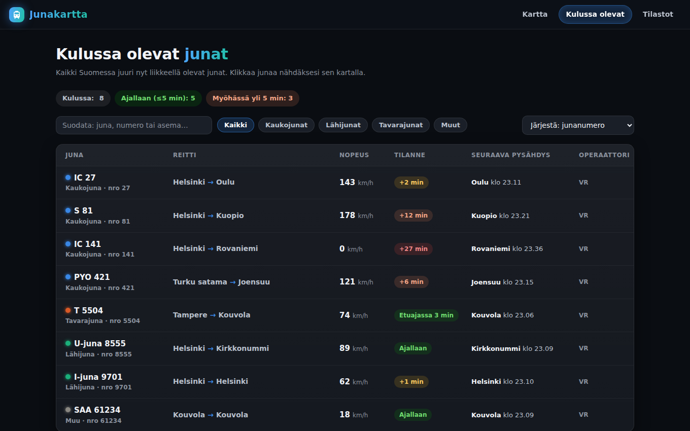
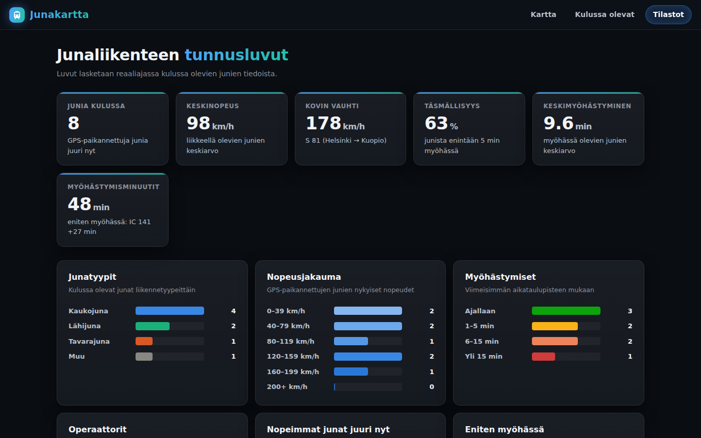
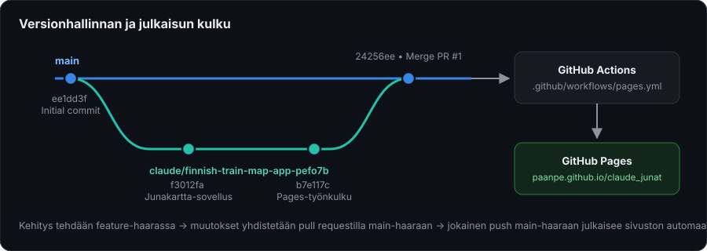

# Junakartta 🚆

Interaktiivinen selainsovellus, joka näyttää **Suomen junaliikenteen livenä**
[Fintrafficin Digitraffic-rajapinnan](https://www.digitraffic.fi/rautatieliikenne/) avoimilla tiedoilla.
Junat liikkuvat kartalla reaaliajassa, kulussa olevat junat voi selata listana ja
liikenteen tunnusluvut lasketaan lennossa.

**➡️ Kokeile livenä: [paanpe.github.io/claude_junat](https://paanpe.github.io/claude_junat/)**

---

## Sisällys

- [Ominaisuudet](#ominaisuudet)
- [Kuvakaappaukset](#kuvakaappaukset)
- [Käynnistys paikallisesti](#käynnistys-paikallisesti)
- [Arkkitehtuuri ja tiedostorakenne](#arkkitehtuuri-ja-tiedostorakenne)
- [Tietolähteet ja rajapinnat](#tietolähteet-ja-rajapinnat)
- [Julkaisu GitHub Pagesiin](#julkaisu-github-pagesiin)
- [Versionhallinta](#versionhallinta)
- [Lisenssit ja attribuutiot](#lisenssit-ja-attribuutiot)

---

## Ominaisuudet

### 🗺️ Kartta (`index.html`)

- **Liikkuvat junat**: GPS-sijainnit haetaan 5 sekunnin välein ja liike
  interpoloidaan sulavaksi ruudunpäivityksissä. Liikkeellä olevan junan merkki
  on nuoli, joka osoittaa kulkusuuntaan; pysähtynyt juna näkyy pisteenä.
- **Junatyypit väreillä**: kaukojunat (sininen), lähijunat (vihreä),
  tavarajunat (oranssi) ja muu liikenne (harmaa) – selite kartan kulmassa.
- **Rautatieverkko** OpenRailwayMap-tasona tumman taustakartan päällä;
  tason voi kytkeä päälle/pois kartan napista.
- **Junahaku**: hae junanumerolla, lähijunan linjatunnuksella (esim. `U`) tai
  asemalla. Valinta lukitsee kartan seuraamaan junaa – seuranta päättyy
  raahaamalla karttaa tai sirun ✕-napista.
- **Junan tietoruutu**: klikkaus näyttää reitin, nopeuden, myöhästymistilanteen,
  seuraavan pysähdyksen ja operaattorin sekä *Seuraa junaa* -napin.
- **Paikannusnappi** 📍: näyttää oman sijainnin tarkkuusympyröineen ja
  keskittää kartan siihen (selain kysyy paikannusluvan).
- **Syvälinkki**: `index.html?juna=27` avaa kartan suoraan junan IC 27 kohdalle.

### 🚄 Kulussa olevat junat (`junat.html`)

- Lista kaikista Suomessa juuri nyt liikkeellä olevista junista:
  reitti, nopeus, myöhästymistilanne, seuraava pysähdys ja operaattori.
- Yhteenvetosirut: junien kokonaismäärä, ajallaan ja myöhässä olevien osuudet.
- Tekstisuodatin (juna, numero tai asema) ja tyyppisuodattimet
  (kauko/lähi/tavara/muut) sekä lajittelu numeron, nopeuden tai
  myöhästymisen mukaan.
- Rivin klikkaus avaa junan kartalle.
- Tiedot päivittyvät automaattisesti 30 sekunnin välein.

### 📊 Tilastot (`tilastot.html`)

Livenä kulussa olevien junien tiedoista lasketut tunnusluvut:

- junien määrä, keskinopeus ja kovin vauhti (juna ja reitti),
- täsmällisyysprosentti (enintään 5 min myöhässä), keskimyöhästyminen ja
  myöhästymisminuutit yhteensä,
- matkustaja-asemien määrä rataverkolla,
- jakaumat palkkikaavioina: junatyypit, nopeudet, myöhästymiset ja operaattorit,
- top 5 -listat nopeimmista ja eniten myöhässä olevista junista.

Luvut päivittyvät minuutin välein.

## Kuvakaappaukset

| Kulussa olevat junat | Tilastot |
|---|---|
|  |  |

*(Kuvat on otettu sovelluksen kehitystilasta; karttanäkymän näet parhaiten
[live-sivustolla](https://paanpe.github.io/claude_junat/).)*

## Käynnistys paikallisesti

Sovellus on täysin staattinen – build-vaihetta tai riippuvuuksien asennusta ei
ole. Riittää mikä tahansa HTTP-palvelin:

```bash
git clone https://github.com/paanpe/claude_junat.git
cd claude_junat
python3 -m http.server 8000
# avaa selaimessa http://localhost:8000
```

> **Huom.** Suora `file://`-avaus ei toimi, koska selain estää
> rajapintakutsut ilman HTTP-palvelinta (CORS).

### Kehitystila ilman verkkoyhteyttä

Lisää osoitteeseen `?mock`-parametri, esim.
`http://localhost:8000/index.html?mock`, jolloin sovellus käyttää
sisäänrakennettua esimerkkidataa Digitraffic-kutsujen sijaan. Tämä on kätevä
ulkoasun kehittämiseen ja testaukseen.

## Arkkitehtuuri ja tiedostorakenne

Toteutus on vanilla JavaScriptiä ilman kehyksiä; ainoa kirjasto on
[Leaflet 1.9.4](https://leafletjs.com/), joka on vendoroitu repoon, joten
sovellus ei riipu CDN-palveluista.

```
.
├── index.html                   # Karttasivu
├── junat.html                   # Kulussa olevat junat
├── tilastot.html                # Tilastot
├── css/
│   └── style.css                # Yhteinen ulkoasu (tumma teema)
├── js/
│   ├── api.js                   # Digitraffic-rajapintakerros, apufunktiot ja mock-tila
│   ├── map.js                   # Karttalogiikka: merkit, animointi, haku, seuranta, paikannus
│   ├── junat.js                 # Junalistan suodatus, lajittelu ja renderöinti
│   └── tilastot.js              # Tunnuslukujen laskenta ja kaaviot
├── vendor/
│   └── leaflet/                 # Leaflet 1.9.4 (vendoroitu)
├── docs/
│   └── kuvat/                   # READMEn kuvat
├── .github/
│   └── workflows/
│       └── pages.yml            # GitHub Pages -julkaisutyönkulku
└── .nojekyll                    # Estää Jekyll-käsittelyn Pagesissa
```

Kaikki kolme sivua jakavat saman `api.js`-kerroksen, joka hoitaa HTTP-kutsut
(mukaan lukien `Digitraffic-User`-tunnisteotsakkeen ja CORS-varautumisen),
aikamuotoilut sekä junadatan tulkinnan (reitti, myöhästyminen, seuraava
pysähdys, junatyyppi).

## Tietolähteet ja rajapinnat

| Tieto | Rajapinta | Päivitysväli |
|---|---|---|
| Junien GPS-sijainnit ja nopeudet | `GET /api/v1/train-locations/latest` | 5 s (kartta) |
| Kulussa olevien junien aikataulut | GraphQL `currentlyRunningTrains` (`POST /api/v2/graphql/graphql`) | 30–60 s |
| Asemien metatiedot | `GET /api/v1/metadata/stations` | tilastosivun latauksessa |

Kaikki kutsut menevät osoitteeseen `https://rata.digitraffic.fi` suoraan
selaimesta – välipalvelinta ei tarvita, koska Digitraffic sallii
CORS-pyynnöt.

Karttatasot:

- Taustakartta: [CARTO Dark Matter](https://carto.com/) (© OpenStreetMap © CARTO)
- Rataverkko: [OpenRailwayMap](https://www.openrailwaymap.org/) (CC-BY-SA)

## Julkaisu GitHub Pagesiin

Sivusto julkaistaan automaattisesti **GitHub Actionsilla**:
[`.github/workflows/pages.yml`](.github/workflows/pages.yml) käynnistyy
jokaisesta `main`-haaran pushista (tai käsin *workflow_dispatch*ista),
pakkaa repon sisällön sellaisenaan ja julkaisee sen GitHub Pagesiin
`actions/deploy-pages`-toiminnolla. Build-vaihetta ei ole, koska sovellus on
valmiiksi staattinen.

Julkaistu sivusto: **<https://paanpe.github.io/claude_junat/>**

Kertaluonteinen asetus (tehty tässä repossa): *Settings → Pages →
Build and deployment → Source: **GitHub Actions***.

## Versionhallinta

Repo noudattaa kevyttä feature branch -mallia:



- **`main`** on julkaisuhaara: sen sisältö vastaa aina GitHub Pagesissa
  julkaistua sivustoa, koska jokainen push `main`-haaraan käynnistää
  julkaisutyönkulun.
- **Kehitys tehdään feature-haaroissa** (esim.
  `claude/finnish-train-map-app-pefo7b`), joissa muutokset committoidaan
  pienissä, kuvaavissa erissä suomenkielisin commit-viestein.
- **Muutokset yhdistetään pull requestilla** `main`-haaraan
  (esim. [PR #1](https://github.com/paanpe/claude_junat/pull/1), jolla
  sovellus ja julkaisutyönkulku tuotiin repoon). PR kokoaa muutokset
  katselmoitavaksi ennen julkaisua.
- Mergen jälkeen feature-haara aloitetaan tarvittaessa uudelleen tuoreesta
  `main`-haarasta, jotta uusi työ ei kasaudu jo yhdistetyn historian päälle.

## Lisenssit ja attribuutiot

- **Liikennetiedot**: [Fintraffic / digitraffic.fi](https://www.digitraffic.fi/),
  lisenssi [CC BY 4.0](https://creativecommons.org/licenses/by/4.0/)
- **Taustakartta**: © [OpenStreetMap](https://www.openstreetmap.org/copyright)
  -tekijät, © [CARTO](https://carto.com/)
- **Rataverkkotaso**: © [OpenRailwayMap](https://www.openrailwaymap.org/) (CC-BY-SA)
- **Leaflet**: [BSD-2-Clause](https://github.com/Leaflet/Leaflet/blob/main/LICENSE)
